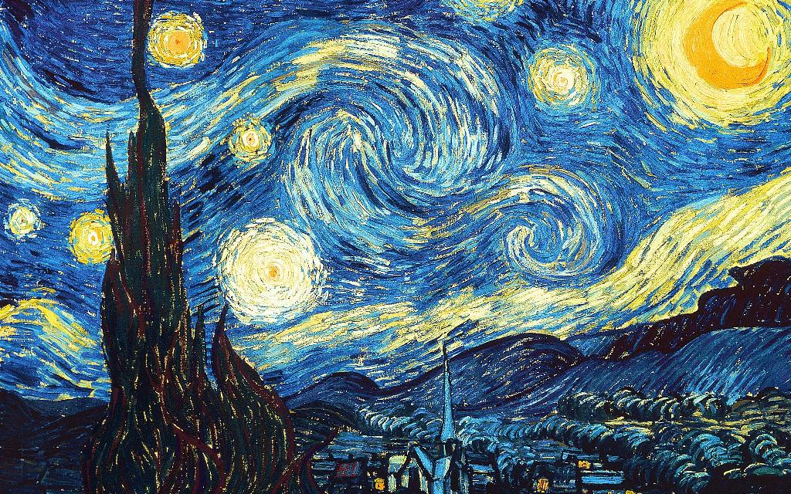

# style-transfer-vgg
Artistic Style transfer using VGG19

Implementation of a VGG19 network with modifications to enable it to do very nice style transfers and make a video of the process!

Van Gogh + Golden Gate bridge:
 

 

This implementation is from the book - PyTorch for Deep Learning and Computer Vision. (Rad, Slim, Slim, Tanveer).
https://subscription.packtpub.com/video/application_development/9781838822804

